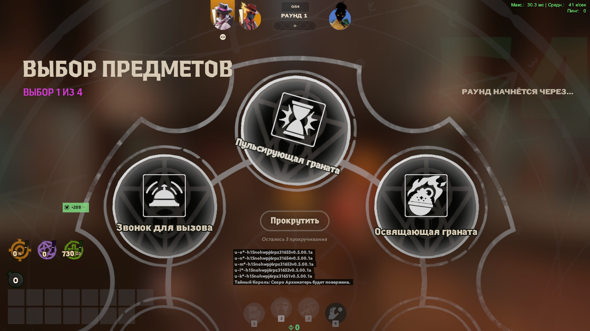

# Ability Draft for Deadlock

**English** · [Русский](README.ru.md)

A server-side [Deadworks](https://github.com/Deadworks-net/deadworks) plugin. Every player drafts four abilities
from other heroes on the Street Brawl draft screen, then the lobby plays Standard or Street Brawl with those kits.

Everything runs on a server you host; players join with `connect` and need to install nothing. An optional client
addon ([`clientside/`](clientside)) adds mouse picks on the draft screen and a working TAB upgrade view.



## How a game goes
1. Somebody starts the server. Players open the Deadlock console and type `connect <ip>:27067`, then pick heroes
   (the usual way, or `/hero haze` and `/team amber|sapphire` in chat). A hero somebody already has cannot be picked.
2. The **lobby leader** (the first player who joined) types **`/draft`** in chat.
   Or **`/chaos`**: everyone gets a random hero and four random abilities, nobody picks anything.
3. Rules vote: type **1** for Standard or **2** for Street Brawl in chat. 25 seconds; a tie goes to the leader's
   vote, otherwise to Standard.
4. The match starts and the **stock Street Brawl draft screen opens with ability cards**. Four picks, the last one
   is the ultimate, with three rerolls per pick on the stock Reroll button.
   **Take a card by typing its number in chat: Enter → `1`, `2` or `3` → Enter (left, top, right).** The message is
   not shown to anyone. With the client addon and `/click` a card can simply be clicked.
5. Street Brawl: after the fourth ability the same screen goes on to the usual items, and the match continues as
   Street Brawl.
   Standard: once everyone has four abilities (or after 50 seconds — the rest is filled in at random) the map reloads
   into a normal match, and the plugin puts every player back on their team and hero with their drafted kit.
6. When the match ends, the lobby reopens after 20 seconds: everyone but the lobby leader is kicked and the map
   reloads. `/newdraft` (leader) does the reload at any time, without kicking.

No two players get the same ability or the same hero. A card another player takes while it is on your screen is
replaced for free.

The drafted kit is written into the server's own table of the hero's abilities, so the game treats it as the hero's
kit: unlocking and upgrading (ALT + ability key) and items that attach to one ability work for every player, with
nothing installed. That table is per hero, which is one more reason heroes are unique.

If the stock screen is unavailable — after a game patch the plugin may fail to find the game functions it needs, see
[PATCHING.md](PATCHING.md) — the draft falls back to a text menu in front of the crosshair before the match starts:
`1`-`3` picks a card, `R` + `1`-`3` replaces it.

## Install (server owner only)
Windows only: Deadworks has no Linux build because Valve ships no Linux server for Deadlock.

1. Deadlock from Steam (or a separate copy through SteamCMD, app `1422450`).
2. [.NET 10](https://dotnet.microsoft.com/download/dotnet/10.0).
3. The latest [Deadworks release](https://github.com/Deadworks-net/deadworks/releases), unpacked into the Deadlock folder.
4. The zip from this repository's [Releases](../../releases), unpacked into the same Deadlock folder.
5. Run `game\bin\win64\start-abilitydraft.bat`.

Join your own server with console (`` ` ``) → `connect localhost:27067`.

**Friends outside your network do not need port forwarding.** On start the plugin switches on joining through Steam
and prints the command for it in the server log (`STEAM CONNECT: connect [A:1:…]`); the lobby leader also gets it in
chat on joining, and `/id` shows it again. Friends paste that whole line, brackets included, into their console. The
id changes every time the server starts. Joining by address works too: forward UDP/TCP 27067 on the router and use
`connect <ip>:27067`. Start the server with `-ad_nosteamconnect` to keep Steam joining off.

Running the server and the game on one machine takes a lot of memory. It works on 8 GB, but a map load takes about a
minute, and so does the reload into Standard.

### Building from source
```
dotnet build AbilityDraft -c Release
pip install capstone
python tools\find_sigs.py
```
The build copies the plugin into `game/bin/win64/managed/plugins`; `find_sigs.py` writes the signature file next to
it. If Steam is not in `C:\Program Files (x86)\Steam`, add `-p:DeadlockDir="<Deadlock folder>"` to the build and pass
the folder to the script. Start the server with `tools\host.ps1` (or `tools\host.ps1 -Lan`).

## Settings
`game\bin\win64\managed\plugins\AbilityDraft.config.json` is created on the first start and read again at every
map start and on `/draft`:
```json
{
  "Blacklist": ["Hotel Guest", "ability_frank_revive"],
  "Language": "en",
  "MaxPlayersStandard": 12,
  "MaxPlayersStreetBrawl": 8,
  "UniqueHeroes": true,
  "SecondsAfterMatch": 20
}
```
- `Blacklist` — abilities that are never offered. Use the internal name or the English or Russian name; all of them
  are in `AbilityDraft.abilities.txt` next to the config. Names the plugin does not recognise are reported in the log.
- `Language` — `"en"` or `"ru"`: the language of the plugin's messages. A player can switch their own with
  `/lang ru` or `/lang en`.
- `MaxPlayersStandard`, `MaxPlayersStreetBrawl` — how many players the lobby takes; a player over the larger number
  is turned away. With more players in the lobby than the Street Brawl number, a vote for Street Brawl plays Standard.
- `UniqueHeroes` — `true`: a hero somebody already has cannot be picked.
- `SecondsAfterMatch` — after a match ends, seconds until everyone but the lobby leader is kicked and the lobby
  reopens. `0` switches this off.

## Optional client addon
[`clientside/pak01_dir.vpk`](clientside) is ready to install; [`clientside/README.md`](clientside/README.md) says
how. Players with and without it play in the same lobby. It adds:

- **Clickable draft cards with the ability's tooltip.** Type `/click` in chat before the draft. Every ability gets a
  twin item (`ad_<ability>`) the stock screen can safely "buy"; the plugin answers the purchase with the ability.
  The taken card grows and the other two fade, as in a normal Street Brawl draft.
- **The TAB upgrade view.** A click on an ability trains it, and the upgrade pips show the drafted kit's real state.
  This part comes through the Deadworks UI bridge, which the VPK includes unchanged.

The VPK carries a copy of the game's ability data, so it has to match the game build (see the file in `clientside`)
and be rebuilt after every patch that touches items or abilities:
```
tools\dump-vdata.ps1 -Vrf <vrf.dll>
python tools/build_cards.py dist/cards --csdk "<Reduced_CSDK_12 folder>"
```
This needs [CSDK 12](https://deadlockmodding.pages.dev/modding-tools/csdk-12) for its resource compiler. The script
writes `dist/cards/abilitydraft_cards_dir.vpk`.

## After a game patch
Deadworks stops starting until its next release, and the plugin's own signatures may need regenerating.
[PATCHING.md](PATCHING.md) lists what to check, in order.

## Known limits
- **Without the addon, ability cards cannot be clicked.** The stock screen treats every card as an item, and buying
  an "item" that is really an ability crashes the client, so the plugin marks the cards as already taken: a click
  does nothing and picks go through chat.
- **Without the addon, the TAB upgrade view is drawn for the hero's original abilities**: a click there does nothing
  and the pips stay empty. ALT + ability key works. With the addon the pips flicker now and then, because the game
  keeps resetting them and the addon keeps putting them back.
- **The header still says "item draft".** That text is in the client's localization.
- **Standard gives 50 seconds for all four picks**, because the draft borrows Street Brawl's first buy phase.
- **Baba's abilities are in the pool although the hero is not released**, so they may be unfinished. Put them on the
  blacklist if they misbehave.
- Tested by one player with bots on build 6759 with Deadworks v0.5.4. A lobby of several people, a match played to
  its end (the reset and the kick), the player cap and the hero lock have not been tried with real players.

## What is inside
- `AbilityDraft/` — the plugin (C#): `DraftPlugin.cs` (phases, vote, the text-menu draft), `NativeDraft.cs` (the
  draft on the stock screen, the switch to Standard), `HeroBinding.cs` (the kit as the hero's own), `Session.cs`
  (player cap, unique heroes, the reset after a match, `/chaos`), `Training.cs` and `Imbue.cs` (upgrades and
  ability-targeted items for kits that could not be made the hero's own), `Native.cs` (game functions found by
  signature), `Config.cs`, `Match.cs`, `Lobby.cs`, `Ui.cs`, `Debug.cs` (log and a file-driven test bridge),
  `AbilityPool.g.cs` (ability names, generated).
- `addon/` — the client addon's own script, layouts and style. `clientside/` — the addon, built.
- `tools/` — server start scripts, the ability pool generator, the signature finder, the addon builder, release
  packaging, a crash dump reader.
- `showcase/` — a clip and screenshots.

Upgrading by click, ability-targeted items and the idea of making the kit the hero's own follow
[Binger4/Deadlock-Ability-Draft](https://github.com/Binger4/Deadlock-Ability-Draft) (MIT).

The only game data in this repository is inside `clientside/pak01_dir.vpk` (see the notes next to it). The mod was
built with AI assistance (Claude Code + universal-modder). Use it on your own servers only; it does nothing to
Valve's official servers.
